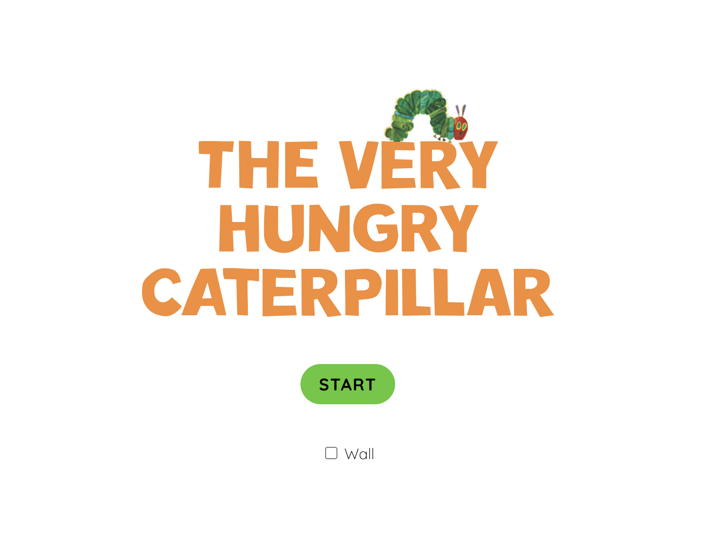
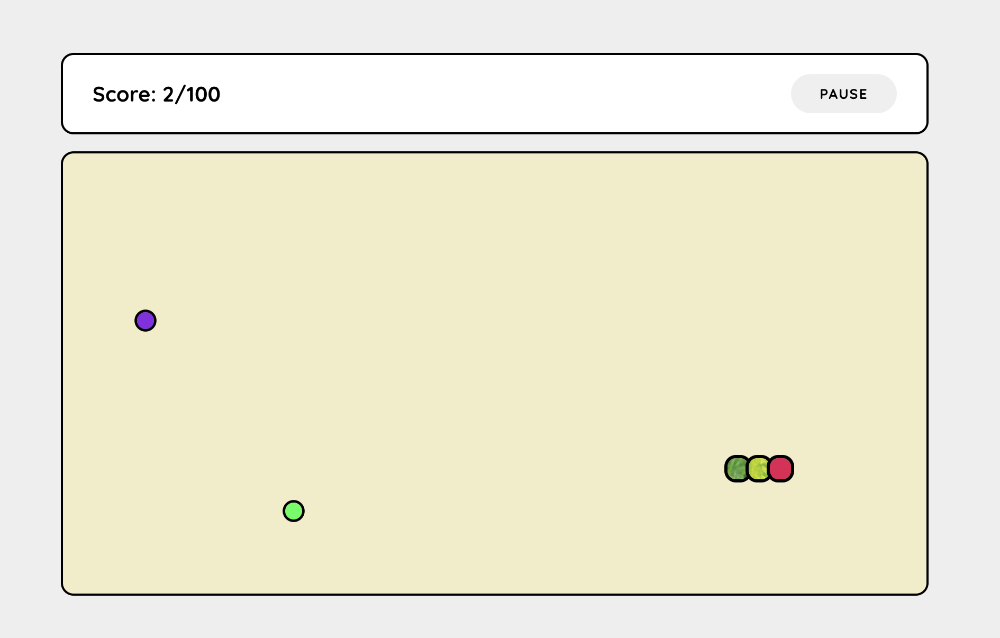

# Hungry Caterpillar - Snake Game

A fun and nostalgic twist on the classic Snake game, inspired by the beloved children's book _The Very Hungry Caterpillar_. Guide your caterpillar through the screen, eating food to grow longer and trying to avoid crashing into walls or your own tail. Collect enough food to reach a score of 100 and win the game!

## Game Link

[Play the Game Here](https://pn-snake.netlify.app/)

## How to Play

- **Arrow Keys**: Use the Arrow keys (Up, Down, Left, Right) to change the caterpillar’s direction.
- **ESC Key**: Pause and resume the game at any time.
- **Space Bar**: Restart the game after it’s over.
- **Walls**: Walls are disabled by default but can be enabled before starting the game for an extra challenge.
- **Goal**: Collect food to grow your caterpillar and score 100 points to win.
- **Game Over**: The game ends if the caterpillar collides with the walls or its own body.

## Technology Used

- **Frontend**:

  - **HTML5** for game structure and rendering.
  - **CSS** for styling and layout.
  - **JavaScript** for game logic, including movement, collision detection, scoring, and restart functionality.

- **Graphics**:
  - Custom illustrations or pixel art for the caterpillar, food, and background elements to give it that Hungry Caterpillar feel.

## Screenshots / Demo (optional)

---

## Pseudocode Summary of Hungry Caterpillar Snake Game

### Initialize the Game Area:

1. Set up a grid with specified width and height.
2. Add tiles to the grid to represent the game area.

### Initialize Game State:

1. Set the initial snake position (e.g., head at `(2, 0)`).
2. Set initial snake direction (e.g., moving right).
3. Set score to 0.
4. Set the initial food and life positions.
5. Set win condition (e.g., 100 points to win).
6. Set up timers for food and life regeneration.

### Game Loop (Move Snake):

1. If game is paused, skip movement.
2. Calculate the new head position of the snake based on the current direction.
3. Check if the new head position is:
   - **Food**: If true, increase score and generate new food.
   - **Life**: If true, increase score and remove 3 segments from the snake.
   - **Wall Collision**: If walls are enabled, check for collision. If true, end the game.
   - **Self Collision**: Check if the head collides with any body part. If true, end the game.
4. If the snake does not eat food, remove the last segment (tail).
5. Add the new head to the front of the snake's body.
6. Redraw the snake and update the score.

### Start Game:

1. Initialize snake position and direction.
2. Start game loop to move the snake.
3. Begin food and life regeneration timers.

### Pause Game:

1. Toggle the game paused state.
2. Update the "Pause/Resume" button text accordingly.

### Restart Game:

1. Reset the snake, score, and game state.
2. Restart the game loop and timers.

### Game Over:

1. Stop the game loop.
2. Disable buttons and show "Game Over" message.

### Win Condition:

1. Check if the score reaches the win condition.
2. Stop the game loop and display "You Win!" message.

### Change Snake Direction:

1. Update the direction based on user input (arrow keys or on-screen buttons).
2. Prevent reversing direction (e.g., no moving left when already moving right).

---

### Key Functions:

- **moveSnake()**: Handles the snake's movement, collision checks, food and life handling, and game over conditions.
- **addFood()**: Randomly generates a new food item on the grid, avoiding the snake's body and life.
- **addLife()**: Randomly generates a new life item on the grid, avoiding the snake's body.
- **checkWall()**: Checks if the snake's head hits a wall (if walls are enabled).
- **selfCollision()**: Checks if the snake's head collides with its body.
- **gameOver()**: Ends the game when the snake collides with itself or a wall.
- **gameWin()**: Ends the game when the score reaches the win condition.

### Possible Extensions / Future Enhancements:

1. **Multiple Levels**: Unlock new stages with different environments or more complex obstacles as you progress.
2. **Power-ups**: Introduce special food items that give temporary abilities like speed boosts or invincibility.
3. **Leaderboards**: Store and display the highest scores for a competitive element.
4. **Story Mode**: Integrate the theme of _The Very Hungry Caterpillar_ with different stages where the caterpillar "grows" and changes colors as it eats, similar to the book.

Does this help? Let me know if you want any specific features or additions, or if you need more details on the technical aspects!
